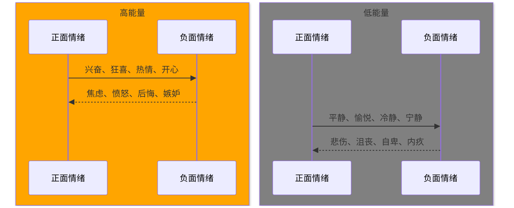

[TOC]

-------

> 高情商的人在沟通时，不是没有情绪，也不是在控制情绪，而是把每种情绪的能量都作为资源，因势利导，为我所用。

### 关注感受，小情绪大影响

科学家研究了大脑杏仁核被切除的患者，发现他们能够分析思考，只是丧失了决策的能力，而杏仁核是人储存情感体验的器官。这说明人的决策是需要有情绪参与的。

在沟通中，如果我们受到情绪的干扰，情绪过多或者情绪不足，都会影响我们的决策和判断，从而使沟通受到影响。

情绪作为脑内的检测系统，对其他思维活动也具有引导协调的作用。

当我们情绪积极的时候，思维开放，容易看到事物美好的面，愿意接纳事物。一个人愉悦的时候，人也会变得更容易沟通。

而消极情绪会使个体感到悲观、失望，接纳程度下降，人会变得挑剔，攻击性增强。

### 调整坐标，沟通事半功倍

情绪与能量

在不同的情绪状态下，人会呈现出不同的思维和行动状态。情绪是行为背后的“操盘手”。

**情绪唤醒程度高、愉悦程度高的时候，称之为“活跃象限”**
- 人的情绪呈现：兴奋、激动、欢喜、欣喜若狂
- 人的行为表现：热情、激动、活跃、有创造力、有感染力、有行动力
- 人的沟通表现：积极开放、有感染力、从众、容易说大话、过分承诺，也容易被“忽悠”

**情绪唤醒程度高、愉悦程度低的时候，称之为“进攻象限”**
- 人的情绪呈现：愤怒、狂躁、宣泄、奋进、焦虑
- 人的行为表现：攻击性高、压力下的进取、“你死我活”的获胜愿望、容易爆发负面情绪
- 人的沟通表现：语言有攻击性，偏激，坚持自己的观点，强势

**情绪唤醒程度低、愉悦程度低的时候，称之为“审视象限”**
- 人的情绪呈现：忧虑、忧伤、抑郁、疲惫的感受
- 人的行为表现：挑错、担忧、不认同、排查问题、行动力不足
- 人的沟通表现：不热情、不配合、挑剔、抱怨、发牢骚、担心

**情绪唤醒程度低、愉悦程度高的时候，称之为“理性象限”**
- 人的情绪呈现：平和、愉悦、淡定、喜悦
- 人的行为表现：平静、接纳、认同、情绪比较稳定
- 人的沟通表现：积极乐观、理性平和、倾听、反思、感悟，乐于听取意见，能够表达己见，努力争取双赢

“让情绪为我所用。”
- 在活跃象限下，人的头脑灵活，很多积极的创意都来自这样的情绪状态
- 在进攻象限下，人会变得坚韧而有进取心，适度的压力也可以让我们提高效率
- 在审视象限下，人们严谨而蹈矩
- 在理性象限下，人们的专注力会提升，注意力会集中，变得平和、放松、积极开放而充满智慧

### 对症下药，心对了事才能成

#### 进攻象限：点火就着的定时炸弹

**攻击情绪，先降温再转化**
以毒攻毒、以暴制暴、“杀敌一千，自损八百”的沟通“气势”，可能只是人们“无计可施”时的“无奈之举”，副作用很大。对于“攻击”的情绪，最重要的应对方式是先降温。

#### 审视象限：先高兴起来再说

选对时机、注意方式，对情绪处于“审视象限”的人特别重要。实在需要当下处理，也要先缓和气氛。

要语气和缓，表情温暖，理解一下对方的处境和心情。或者采取一些非面对面的沟通方式：发个短信，写个邮件。沟通要的是结果，绕过那些纠结的情绪，才能把事办成

#### 活跃象限：乐极容易生悲

人生失意莫放弃，人生得意莫忘形

**兴奋情绪，先晾晾再说**

太兴奋的时候，人们往往会盲目乐观，容易冲动。

#### 理性象限：心对了，事就成了

**修炼个性，学会驾驭情绪**

修炼个性、保持身体的健康，才会让人有平静而饱满的情绪状态，充满正能量。此时人们能自如地转化各种情绪，让情绪真正地成为资源，为我所用。

-------
