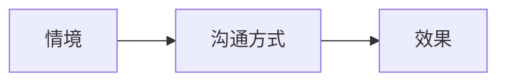

[TOC]

-------

> 我们按照内心预设的“剧本”，在人生的舞台上，出演着自己的“角色”，重复着自己熟悉的“台词”。
> 若你想改变命运，就该修改“剧本”，重塑“角色”，让“台词”翻新。

### 人生的自动导航

**自动导航语言系统**

我们如何说话，是一种从小在成长的环境里潜移默化习得的一种“习惯”。这种“习惯”，在大脑里慢慢地变成了一种稳定的、不易察觉的、“自动导航”的“对话方式”。

这些“说话方式”就像你走路的姿势、面部的表情、惯性的思维一样，经年形成，下意识发生，很难察觉和改变。

若把我们的“对话方式”比喻成人生的“台词”，而产生这个“说话方式”的内在心理过程，就是我们的“人生剧本”。我们按照预设的“剧本”，在人生的“舞台”上，出演着自己的“角色”，不断重复着自己熟悉的“台词”。

#### 难改的“童子功”

“说话方式”是我们每个人从小为了应对关系练就的“童子功”。在这个功夫上，每个人都是自学成才，各有一套。一旦形成，很难改变。

一家人之间的沟通，都如此不容易。在社会关系中，基于合作和利益的考虑，人们则更难彼此反馈说话方式的问题。

当有人对你的说话方式不满意，他多半只会通过调整与你的“关系”来进行适应，这可能是客气与敬而远之，也可能是当面顺从、背后却牢骚满腹。这些间接的反馈方式，都让你很难直接地体会和察觉到你的说话方式的问题。

#### 为何人生不断重演

我们靠着各自习惯的方式不断重复上演着不变的“人生剧本”。

#### 情境引发改变

**自动导航系统失效**

当我们的人生获得了成长，来到新的阶段时，我们一定会面临新的挑战，遇到新的人，承担新的任务，扮演新的角色，与此同时，迎来新的对话情境。

### 给自己一个“语言整理窗”

**语言整理窗**

- 打断旧的语言自动导航系统

突然意识到，自己与别人沟通时的模式竟然和母亲一模一样。这种意识，就是对我们“自身问题”非常宝贵的觉察。

自动导航的觉察往往要遭受痛苦和挫败，自动导航的改变也没有那么容易。因为你的自动导航，是积年累月产生的一种巨大的惯性。要想让它彻底停用，就需要我们对自动导航在过去的意义和价值，以及在当下的不适应的原因，都有所分析，获得领悟。这个领悟，是在对话整理窗中完成的。

- 不同“台词”调“剧本”

沟通的技巧只是“台词”，而内在的模式是剧本。如果剧本没有改，台词是很难有大的变化的。

人生剧本的修改有很多方式，心理学是其中一个很好用的方法。我们打个比方，把整理内在剧本的过程，叫作进入“对话整理窗”。

有哪些常用的心理学方法可以完成对自我内在的整理呢？

- 精神分析法

精神分析是传统的心理咨询和治疗技术，也是一种人格的解读模式。在精神分析的整理窗里，会对你过往的人生经历做一个详细的梳理，特别是你的一些童年经历和重要的抚养人对你的影响。

- 行为认知法

认知行为治疗是非常理性的一种整理方法。在这个沟通整理窗里，把我们的信念分为了表层信念、中间信念、核心信念几个层次。这足以帮助你梳理自己的想法、价值观以及对自己的内在态度。很有可能这其中就会有导致你沟通失败的一些非理性的认知。把这些认知调整好了，说话的方式自然就改变了。

- 书写整理法

书写，就是由自己来写。把自己的感受、想法、念头等都转化成文字。书写是与自己内心对话的过程，写清楚自己的“心事”，自然也就能说好心里话。

所有的对话整理过程，都是为了打破旧的语言自动导航系统，获得拓展性的体验和认知，为掌握新的说话方式做好准备。

- 在情境中实现“逆袭”

当一些新的对话挑战来到我们的生活里，或者一些痛苦的对话反复重现时，都会唤醒我们大量的体验。

在你成功地觉察并打断自动导航，完成在沟通整理窗的整理和反思后，这还不够，最重要的是我们要输出新的沟通行为，去解决现实的对话问题。

而新的沟通行为，一旦经过实验，成功了，产生了新的效果，那么这个行为就会不断被奖励和保留下来。你也就实现了语言自动导航系统的全新升级。你变得越来越会沟通，增加了应对社会和人际的灵活性。

-------
