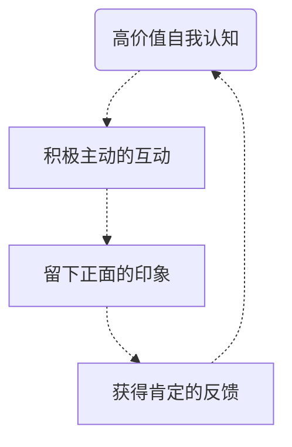
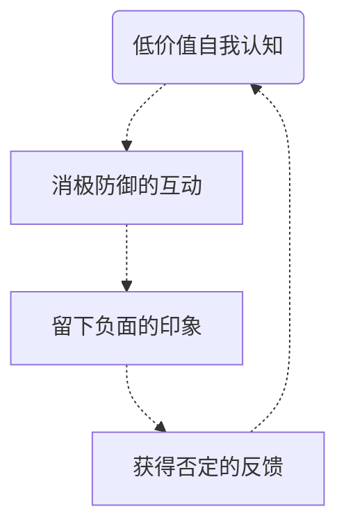

[TOC]

-------

> 你所说的一切，都反映出你在内心里，对待自己，对待他人，对待世界的态度。而你的态度，又无时无刻不在影响着你和他人的关系。用心爱自己，与对的人，说美好的话。

### 高价值互动循环：提升自我价值感

高价值互动循环图：

#### 懂得发现美好

拥有一颗发现美好的心，就会像磁铁一样，无论到了哪里，都能吸引有用的资源、美好的事物以及幸福的生活。这颗心会促生高自我价值感。

#### 发现自己的优势

一个懂得发现美好的人，是先从欣赏自己、发现自己的美好开始的。

##### 情绪信号法

在充分发挥优势、做自己喜欢和擅长的事情时，情绪会传递给我们一个“愉悦”而“满足”的信息。

##### 价值反馈法

发挥你的优势，做你擅长的事，总能获得一些回报

那些有价值反馈的地方，一定蕴藏着你的优势

##### 测试法

了解自己的特质，发现自我的优势

##### 前辈指路法

伯乐指点
熟悉你的人

##### 朋友提示法

朋友圈里，哪些事上最需要你

#### 积极的归因方式

积极的归因方式会让我们在遭遇困难和挫折的时候，不会对自己做出太多的怀疑和责备。这保全了我们的自我价值感。而消极的归因方式往往会损伤我们的自我价值感。

#### 提高快乐的能力

要学会放过自己，提高快乐的能力。

快乐是自我价值感最重要的检验。

### 低价值互动循环：逃不开的命运魔咒

低价值互动循环图：

#### 把别人都当作看不起自己的人

内心害怕不被认可的人，总是会对自己的认知忽高忽低。一方面表现得没有自信，另一方面又会通过“吹牛”和“得瑟”避免让别人看不起自己。

低价值的自我认知会导致 **“不被认可感”**

不被认可的互动，会让他人心生嫌弃，导致自身“被羞辱”“被攻击”，从而加深一个人的不被认可感

#### 把别人都变成不相信自己的人

低价值的自我认知会导致 **“I'M LOSER”的失败模式**

失败模式会让他人心生轻视，导致自身“被忽略”“被贬低”，从而加深一个人的失败感

#### 把别人都变成伤害自己的人

低价值的自我认知会导致 **“不敢信任”**

不敢信任的互动，会让他人心生厌烦，导致“被攻击”“被抛弃”，从而加深不敢信任

-------
